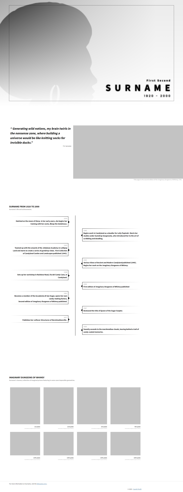

# templates-tribute

|   |   |
|---|---|
|   |    |
| [template](https://gperilli.github.io/templates-tribute/) | [demo](https://gperilli.github.io/templates-tribute/demo) |


This is a HTML single page ecommerce frontend template and demo. Items selected for purchase will appear in the shopping basket which will slide in from the right when opened. The total price of multiple items is calculated and displayed, but there is no connection to a server-side payment processor (such as Stripe). The original deisgn came from [https://imransdesign.com/](https://imransdesign.com/). I have removed Bootstrap from the source, created a shopping cart and responsive nav bar and reduced everything down to a single page template and demo. 


## Built With
- [Vanilla JS](https://developer.mozilla.org/en-US/docs/Web/JavaScript) - vanilla Javascript
- [CSS](https://developer.mozilla.org/en-US/docs/Web/CSS)
- [HTML](https://developer.mozilla.org/en-US/docs/Web/HTML)

## Getting the project files

Either do a direct download using the download option from the code button dropdown near the top of this Github page, or use a git clone command:
```
git@github.com:gperilli/templates-tribute.git
```
<br>

For more information on getting git (version control system) on your local machine, see [this](https://git-scm.com/book/en/v2/Getting-Started-Installing-Git).

## Set Up a Local Development Environment

The web app will run directly on any modern web browser by opening the `index.html` file. The mockup file, `mockup.html`, features real product images and related text.
Editing the code can be done with a simple text edtitor, or something like [Notepad++](https://notepad-plus-plus.org/). [VSCode](https://code.visualstudio.com/), probably the most popular code editor these days, can be used with the Live Server plugin which allows for near-real-time monitoring for the HTML and CSS edits.
